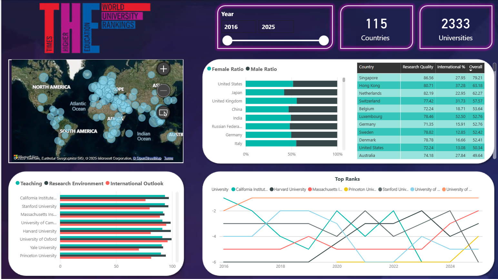

# 🌍 University Ranking Analysis Project

This project analyzes global university rankings over the past decade using a combination of Python, Parse Hub, Excel, SQL, and Power BI to deliver insights for students exploring bachelor's/master’s opportunities abroad.

## 📁 Project Structure

- **data**: [World University Rankings by THE](https://www.timeshighereducation.com/world-university-rankings)
- **final_notebooks**: Jupyter Notebook with data cleaning, processing, and analysis steps.
- **cleaned_data**: Cleaned dataset stored in Excel with 6 sheets (main data, metadata, pivot tables, etc.).
- **queries**: SQL queries used for further exploration and analysis (e.g., top universities by country).
- **dashboard**: Power BI dashboard file (`.pbix`) summarizing insights visually.
- **presentation/**: Final slide deck created using Gamma.

## 🚀 Tools Used

- Python (Jupyter Notebook, Pandas, Matplotlib, Seaborn, Plotly)
- Parse Hub (for web scraping)
- SQL (MSSQL)
- Excel (pivot tables, formatting, metadata)
- Power BI (dashboard with filters, maps, charts)
- Gamma.app (for presentation design)

## 📊 Key Insights

- Trend of top-ranked universities by country
- Female/Male student ratios
- Factors affecting International Diversity
- Top 100 universities by overall score

## 🧠 Target Audience

Current undergraduate students seeking data-driven guidance for master's studies based on university performance metrics.

## 🔗 Additional Resources

- [Kaggle Notebook Link](https://www.kaggle.com/code/moazgehad/world-universities-rank)
- [Gamma Presentation Link](https://gamma.app/docs/World-University-Rankings-ja3egz5lpfhn0nf)
- 

---

